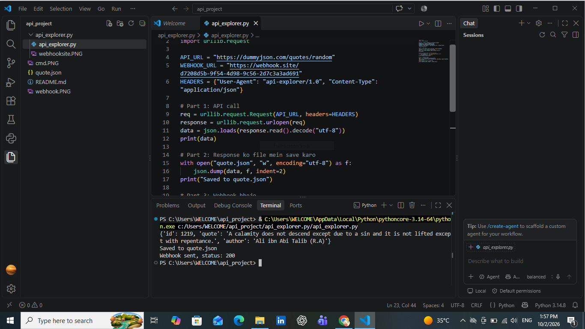
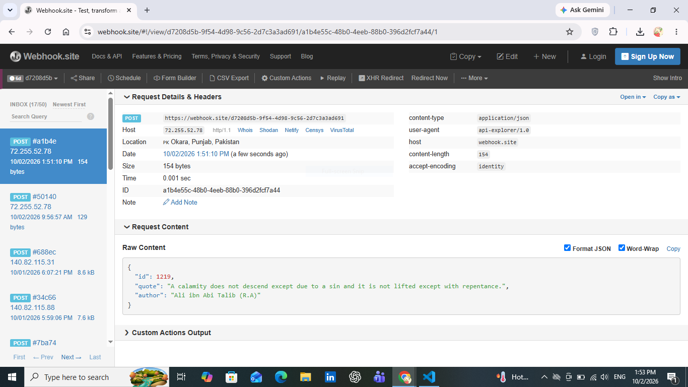

# API Explorer (Python)

This is the Python version of my API Explorer project. A single Python script calls a free public API, saves the response to a file, and then sends that data as a test webhook to webhook.site so I can observe the payload the receiver gets.

## What this project does

1. Calls a free public API and gets a random quote.
2. Saves the API response to a file called `quote.json`.
3. Sends the same data as a `POST` webhook to [webhook.site](https://webhook.site).
4. Inspects the request on webhook.site to see the payload, headers and method.

## API used

**DummyJSON Quotes API**: `https://dummyjson.com/quotes/random`

It is free and needs no signup or API key. Each call returns a random quote as JSON with three fields: `id`, `quote` and `author`.

## Requirements

- Python 3 (I used Python 3.14)
- No extra libraries. The script only uses the built-in `json` and `urllib.request` modules.

## How to run

1. Open `api_explorer.py` and replace `WEBHOOK_URL` with your own unique URL from webhook.site.
2. Open a terminal in the project folder and run:

   ```
   python api_explorer.py
   ```

3. Open your webhook.site page and click the new **POST** request to see the payload.

## The code

```python
import json
import urllib.request

API_URL = "https://dummyjson.com/quotes/random"
WEBHOOK_URL = "https://webhook.site/d7208d5b-9f54-4d98-9c56-2d7c3a3ad691"
HEADERS = {"User-Agent": "api-explorer/1.0", "Content-Type": "application/json"}

# Part 1: API call
req = urllib.request.Request(API_URL, headers=HEADERS)
response = urllib.request.urlopen(req)
data = json.loads(response.read().decode("utf-8"))
print(data)

# Part 2: Save the response to a file
with open("quote.json", "w", encoding="utf-8") as f:
    json.dump(data, f, indent=2)
print("Saved to quote.json")

# Part 3: Send the webhook
body = json.dumps(data).encode("utf-8")
req = urllib.request.Request(WEBHOOK_URL, data=body, headers=HEADERS, method="POST")
resp = urllib.request.urlopen(req)
print("Webhook sent, status:", resp.status)
```

### How the code works

- **Part 1:** builds a request to the API, opens it, reads the response and converts the JSON text into a Python dictionary with `json.loads`.
- **Part 2:** writes that dictionary into `quote.json` using `json.dump`.
- **Part 3:** converts the dictionary back to JSON bytes with `json.dumps` and sends it to the webhook URL as a `POST` request. The `Content-Type: application/json` header tells the receiver the body is JSON.

## Result 1: running the script



The script ran in VS Code and printed three things:

- the quote returned by the API (`id` 1219, author Ali ibn Abi Talib)
- `Saved to quote.json`, which confirms the file was written
- `Webhook sent, status: 200`, which confirms the webhook was delivered successfully

## Result 2: what the webhook receiver got



On webhook.site the request appeared as a new entry at the top of the inbox:

| Field | Value |
|---|---|
| Method | POST |
| Protocol | HTTP/1.1 |
| Size / Content-Length | 154 bytes |
| Content-Type | application/json |
| User-Agent | api-explorer/1.0 |
| Accept-Encoding | identity |
| Host | webhook.site |
| Time taken | 0.001 sec |

**Request body (Raw Content):**

```json
{
  "id": 1219,
  "quote": "A calamity does not descend except due to a sin and it is not lifted except with repentance.",
  "author": "Ali ibn Abi Talib (R.A)"
}
```

The body received by webhook.site is the same data that the API returned.

## What I learned

- An API gives you data when you ask for it (you pull the data).
- A webhook sends data to a URL when something happens (the data is pushed to the receiver).
- In Python, `urllib.request` and `json` are enough to call an API, save a file and send a webhook, with no extra installation.
- The `User-Agent` header lets the receiver see which tool sent the request. In this version it shows `api-explorer/1.0` (my script's custom name). In my earlier curl version it showed `curl/8.13.0`.
- webhook.site is a handy free tool to see exactly what headers and body a webhook request contains.

## Files in this repo

- `README.md`: this file
- `api_explorer.py`: the Python script
- `quote.json`: the saved API response
- `terminal.PNG`: VS Code terminal screenshot
- `webhooksite.PNG`: webhook.site screenshot
